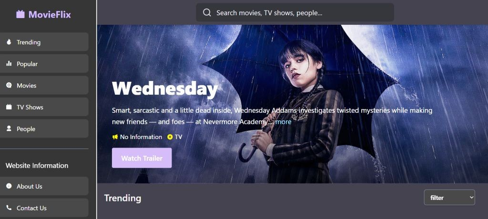
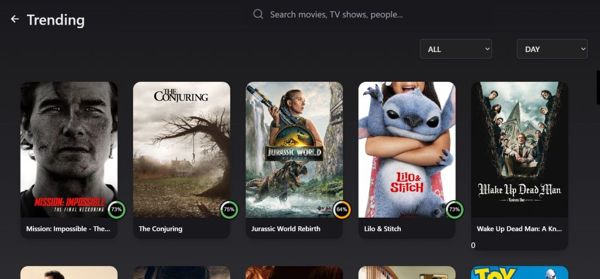
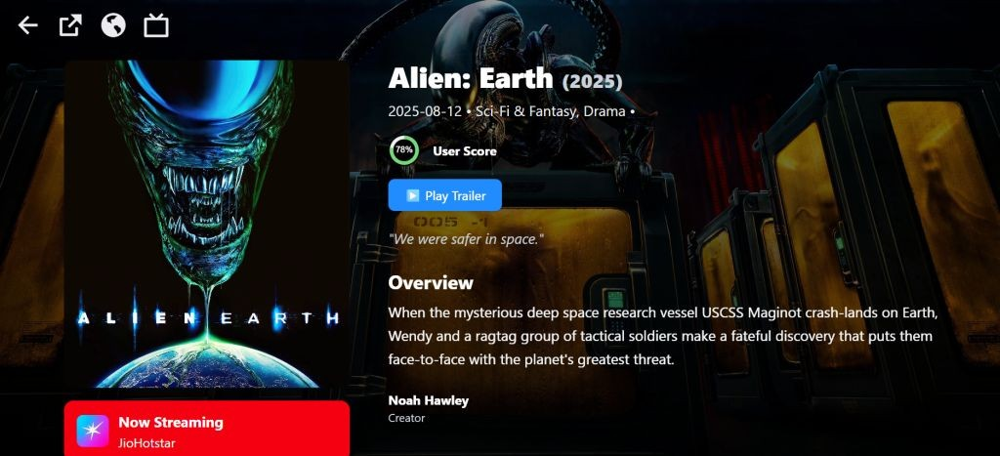

🎬 MovieFlix

MovieFlix is a modern and responsive web application built with React + Vite.
It allows users to explore trending movies, TV shows, popular content, and detailed information like cast, trailers, and ratings — all powered by TMDB API.

🚀 Features

🔥 Trending Section – Browse trending movies and TV shows by day or week.

🎥 Popular & Top Rated – Discover movies and TV shows loved by audiences.

📺 TV Shows & Seasons – Explore episodes, seasons, and detailed show info.

🔍 Smart Search – Search movies, TV shows, and people easily.

📊 User Score – See ratings in a modern circular progress style.

📜 Overview Section – Get detailed descriptions, creators, and trailers.

📱 Fully Responsive – Works seamlessly on desktop, tablet, and mobile.

🖼️ Screenshots
# My Project

  

🏠 Homepage

🔥 Trending Page

# Trending Page

  

🎬 Movie Details
# Details

  

🛠️ Tech Stack

⚛️ React 19 + Vite – Fast and modern frontend setup

🎨 Tailwind CSS – For modern and responsive UI

🌐 Axios – API calls from TMDB

🔄 Redux Toolkit – State management

🎞️ React Player – For seamless trailer playback

♾️ React Infinite Scroll Component – Infinite scrolling feature

📍 React Router DOM – For smooth navigation

📦 Dependencies
"@reduxjs/toolkit": "^2.8.2",
"@tailwindcss/vite": "^4.1.12",
"axios": "^1.11.0",
"react": "^19.1.1",
"react-dom": "^19.1.1",
"react-infinite-scroll-component": "^6.1.0",
"react-player": "^3.3.2",
"react-redux": "^9.2.0",
"react-router-dom": "^7.8.2",
"tailwindcss": "^4.1.12"

⚡ Getting Started
1️⃣ Clone the repository
git clone https://github.com/your-username/movieflix.git
cd movieflix

2️⃣ Install dependencies
npm install

3️⃣ Run the project
npm run dev

